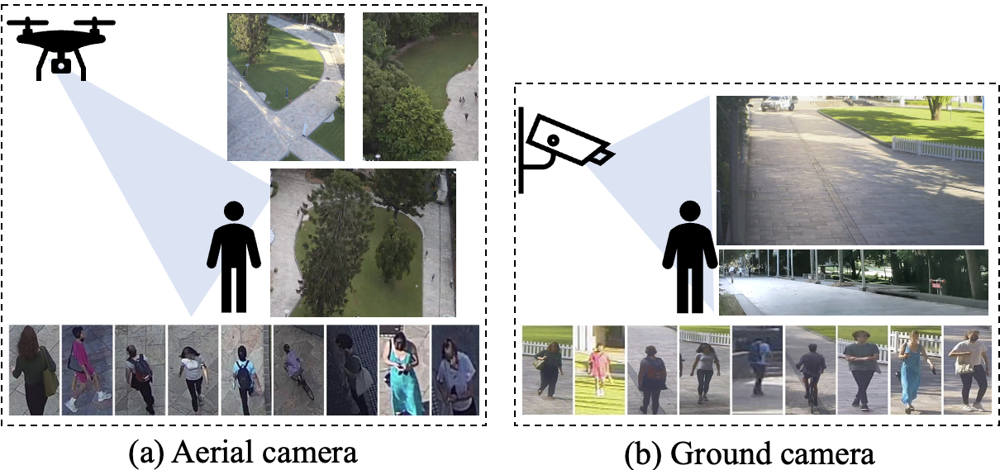
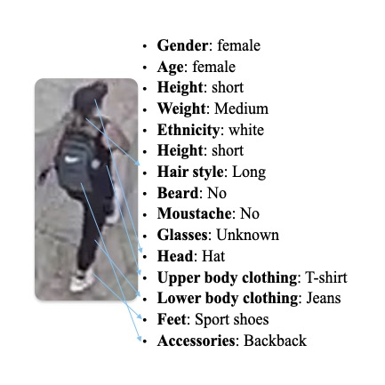

# AG-ReID

**Official repository for ICME2023: Aerial-Ground Person Re-ID**



The evaluation code will be added soon.

## Paper

[[arXiv](https://arxiv.org/abs/2303.08597v3)] [[ResearchGate](https://www.researchgate.net/publication/369266098_Aerial-Ground_Person_Re-ID)]

## About dataset
We have annotated 15 attributes for the [AG-ReID dataset](https://drive.google.com/file/d/1p4pezNgTb681Gi3UcvOHXB5zYMo7qvpY/view?usp=sharing). The dataset comprises of 199 distinct identities for training and another 189 for testing. These attributes are annotated at the identity level, which means that the file contains 15 x 199 attributes for training and 15 x 189 attributes for testing. In this context, the label "image_index" represents the identity. You can find these annotations in the file named qut_attribute_v4_88_attributes.mat.

The 15 attributes include:

| attribute | representation in file | label |
| :----: | :----: | :----: |
| Gender | gender | male(0), female(1), unknown(2) |
| Ages | age | 0-11(0), 12-17(1), 18-24(2), 25-34(3), 35-44(4), 45-54(5), 55-64(6), >65(7), Unknown(8) |
| Height | height | Child(0), Short(1), Medium(2), Tall(3), Unknown(4) |
| Body Volume | weight | Thin(0), Medium(1), Fat(2), Unknown(3) |
| Ethnicity | ethnic | White(0), Black(1), Asian(2), Indian(3), Unknown(4) |
| Hair Color | haircolor | Black(0), Brown(1), White(2), Red(3), Gray(4), Occluded(5), Unknown(6) |
| Hairstyle | hairstyle | Bald(0), Short(1), Medium(2), Long(3), HorseTail(4), Unknown(5) |
| Beard | beard | Yes(0), No(1), Unknown(2) |
| Moustache | moustache | Yes(0), No(1), Unknown(2) |
| Glasses | glasses | Normal_glasses(0), Sunglasses(1), No(2), Unknown(3) |
| Head Accessories | head | Hat(0), Scarf(1), Neckless(2), Occluded(3), Unknown(4) |
| Upper Body Clothing | upper | T-shirt(0), Blouse(1), Sweater(2), Coat(3), Bikini(4), Naked(5), Dress(6), Uniform(7), Shirt(8), Suit(9), Hoodie(10), Cardigan(11), Unknown(12) |
| Lower Body Clothing | lower | Jeans(0), Leggins(1), Pants(2), Shorts(3), Skirt(4), Bikini(5), Dress(6), Uniform(7), Suit(8), Unknown(9) |
| Feet | feet | Sport_shoe(0), Classic_shoe(1), High_heels(2), Boots(3), Sandals(4), Nothing(5), Unknown(6) |
| Accessories | bag | Bag(0), Backpack(1), Handbag(2), Rolling_bag(3), Umbrella(4), Sportif_bag(5), Market_bag(6), Nothing(7), Unknown(8) |

Note that in the .mat file, the original 15 attributes have been transformed into 88 binary-encoded attributes. 

## Sample



## Dataset Download

The dataset is available for [Download](https://drive.google.com/file/d/1p4pezNgTb681Gi3UcvOHXB5zYMo7qvpY/view?usp=sharing) now!


## Annotations

ImageName: **P**0006**T**0214**A**0**C**0**F**1831.jpg

**P**0001: (**P**ersonID) unique identity for the main subject in current video

**T**MMDD0/MMDD1: (**T**imestamp) timestamp of the video, indicating Month / Date / AM (MMDD0) or PM (MMDD1)

**A**0/1/2: (**A**ltitude) indicates the altitude level - low (0), medium (1), or high (2)

**C**0/3: (**C**amera) indicates the type of camera used - UAV - RGB (0) or CCTV - RGB (3)

**F**2281: (**F**rame) represents a specific frame from video


## Person Re-ID Evaluation Protocols

### Aerial-Ground

In the aerial-ground setting, there are 1,701 aerial query images, and  3,255 ground gallery images for 189 identities.

### Ground-Aerial

In the ground-aerial setting, there are 962 ground query images, and 7,204 aerial gallery images for 189 identities.

### Results

#### Rank-1 Evaluation (R50 backbone)

| Models   | Aerial &#8594;  Ground | Ground &#8594; Aerial |
|----------|------------------------|-----------------------|
| BoT(R50) | 73.83                  | 72.45                 |
| MGN(R50) | 75.93                  | **79.42**             |
| SBS(R50) | **79.85**              | 77.75                 |

#### Rank-1 Evaluation (Explainable Stream and ViT backbone)

| Models                  | Aerial &#8594; Ground | Ground &#8594; Aerial  |
|-------------------------| ------------------------- | ------------------------- |
| SBS(ViT)                | 77.27                     | 77.13                     |
| SBS(ViT)  +  Explainable | 77.75                     | 79.52                     |
| BoT(ViT)                | 81.28                     | 82.64                     |
| BoT(ViT) + Explainable  | **81.47**                 | **82.85**                 |


## Citation

```bibtex
@misc{nguyen2023aerialground,
      title={Aerial-Ground Person Re-ID}, 
      author={Huy Nguyen and Kien Nguyen and Sridha Sridharan and Clinton Fookes},
      year={2023},
      eprint={2303.08597},
      archivePrefix={arXiv},
      primaryClass={cs.CV}
}
```

## Contact

`thanhnhathuy.nguyen@hdr.qut.edu.au`
